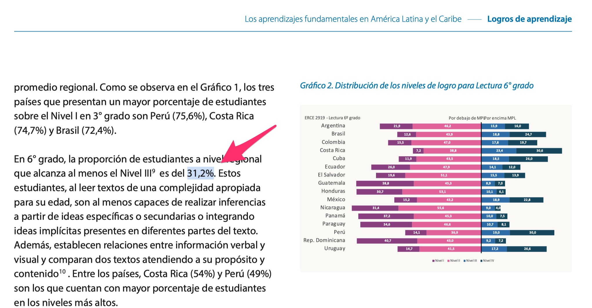

```{r setup, include=FALSE}
#----------------------------------------------------------
# setup
#----------------------------------------------------------


# knitr option
knitr::opts_chunk$set(dev = 'png')
options(knitr.kable.NA = '', digits = 2)
options(scipen = 999999)

# remove all previous objects
rm(list = ls())

# fonts
Sys.setenv(LANG="en_US.UTF-8")


# ------------------------------------------------------
# get times
# ------------------------------------------------------

start_time <- Sys.time()


```

# Introducción

- Es común en la comunicación de resultados de los estudios de gran escala, el emplear cifras de resultados regionales. Es decir, cifras que refieren al conjunto de países participantes.

- Sin embargo, las variables de diseño, empleadas para generar resultados generalizables a la población de estudiantes estan construidas para referir a la población de cada país, y no para referir a la región en su conjunto.

- De esta forma, para escenarios en que se quiere producir una cifra de resultados regionales, se requiere adaptar las variables de diseño muestral del estudio para prodUcir resultados adecuados.

# Cifra de Ejemplo

- En el informe ejecutivo de resultados se indica que 31.2% de los estudiantes alcanzó los niveles esperados de competencia lectora.

```{r echo = FALSE, out.width = '100%', fig.retina = 1}

```

- ¿Cómo se pueden producir estos resultados? Reproducir estos resultados requiere la resolución de una serie de problemas en la producción de resultados. El presente documento dinámico, implementa al menos una forma para reproducir el resultado publicado.


## Abrir datos

```{r echo = TRUE, eval = TRUE}

# -------------------------------------------------------------------
# nivel de lectura en la region
# -------------------------------------------------------------------

#------------------------------------------------
# cargar libreria
#------------------------------------------------

library(dplyr)

#------------------------------------------------
# cluster únicos
#------------------------------------------------

data_example <- erce::erce_2019_qa6 %>%
                erce::remove_labels() %>%
                mutate(id_s = as.numeric(as.factor(paste0(IDCNTRY, "_", STRATA)))) %>%
                mutate(id_j = as.numeric(as.factor(paste0(IDCNTRY, "_", IDSCHOOL)))) %>%
                mutate(id_i = seq(1:nrow(.)))

```

## Crear variables

```{r echo = TRUE, eval = TRUE}

# -------------------------------------------------------------------
# nivel de lectura en la region
# -------------------------------------------------------------------


#------------------------------------------------
# variable dummy para los niveles esperados
#------------------------------------------------

data_example <- data_example %>%
mutate(all = 1) %>%
mutate(lan_min_1 = case_when(
LAN_L1 == 'I'   ~ 0,
LAN_L1 == 'II'  ~ 0,
LAN_L1 == 'III' ~ 1,
LAN_L1 == 'IV'  ~ 1)) %>%
mutate(lan_min_2 = case_when(
LAN_L2 == 'I'   ~ 0,
LAN_L2 == 'II'  ~ 0,
LAN_L2 == 'III' ~ 1,
LAN_L2 == 'IV'  ~ 1)) %>%
mutate(lan_min_3 = case_when(
LAN_L3 == 'I'   ~ 0,
LAN_L3 == 'II'  ~ 0,
LAN_L3 == 'III' ~ 1,
LAN_L3 == 'IV'  ~ 1)) %>%
mutate(lan_min_4 = case_when(
LAN_L4 == 'I'   ~ 0,
LAN_L4 == 'II'  ~ 0,
LAN_L4 == 'III' ~ 1,
LAN_L4 == 'IV'  ~ 1)) %>%
mutate(lan_min_5 = case_when(
LAN_L5 == 'I'   ~ 0,
LAN_L5 == 'II'  ~ 0,
LAN_L5 == 'III' ~ 1,
LAN_L5 == 'IV'  ~ 1))

```

## Declarar diseño

```{r echo = TRUE, eval = TRUE}

# -------------------------------------------------------------------
# nivel de lectura en la region
# -------------------------------------------------------------------

#------------------------------------------------
# base de datos con diseño
#------------------------------------------------

# survey method: taylor series linearization
data_tsl  <- survey::svydesign(
             data    = data_example, 
             weights = ~WS,
             strata  = ~id_s,
             id = ~id_j,
             nest = TRUE)


# Opción: corección a unidad primaria de muestreo que resulte 
# única al estrato

library(survey)
options(survey.lonely.psu="adjust")

```


## Estimar resultados con valores plausibles

```{r echo = TRUE, eval = TRUE}

# -------------------------------------------------------------------
# nivel de lectura en la region
# -------------------------------------------------------------------
#------------------------------------------------
# nivel de lectura esperado
#------------------------------------------------

results <- mitools::withPV(
   mapping = lan_min ~ lan_min_1 + lan_min_2 + lan_min_3 + lan_min_4 + lan_min_5,
   data = data_tsl,
   action = quote(
    survey::svymean( ~lan_min, design = data_tsl)
    ),
   rewrite = TRUE
  )


#------------------------------------------------
# obtener resultados
#------------------------------------------------

summary(mitools::MIcombine(results))


```

## Definir forma de presentación de resultados

```{r echo = TRUE, eval = TRUE}

# -------------------------------------------------------------------
# nivel de lectura en la region
# -------------------------------------------------------------------

#------------------------------------------------
# tabla de medias
#------------------------------------------------

estimados <- summary(mitools::MIcombine(results))

table_read <- estimados %>%
               tibble::rownames_to_column("lan_min") %>%
               rename(
                lan = results, 
                lan_se = se,
                ll = 4,
                ul = 5,
                miss = 6
                ) %>%
               mutate(lan = lan*100) %>%
               mutate(lan_se = lan_se*100) %>%
               mutate(ll = ll*100) %>%
               mutate(ul = ul*100)

# -----------------------------------------------
# mostrar tabla
# -----------------------------------------------

options(digits=10)
options(scipen = 999999)

knitr::kable(table_read, digits = 1)

```

## Exportar resultados

```{r echo = TRUE, eval = TRUE}

# -------------------------------------------------------------------
# nivel de lectura en la region
# -------------------------------------------------------------------

#------------------------------------------------
# exportar resultados
#------------------------------------------------

table_read %>%
openxlsx::write.xlsx(., 
  'tabla_porcentaje_nivel_lectura.xlsx',
  overwrite = TRUE)

```
