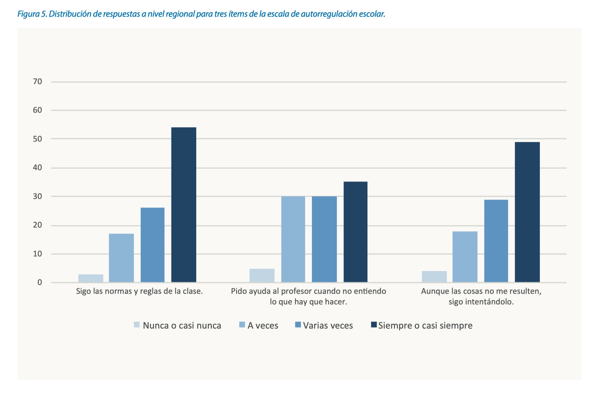

Código: generación de resultados para la región
================
dacarras
Wed Mar 02, 2022

# Introducción

-   En el informe de Habilidades Socioemocionales (UNESCO-OREALC, 2021)
    se reportan porcentajes de respuesta regionales.

-   Al igual que en el caso del problema 3 revisado en el taller, para
    producir resultados a la región se requiere adaptar las variables de
    diseño. Adicionalmente, el cálculo de porcentajes de respuesta de
    una variable categórica no posee un solución sencilla al interior de
    librerías que manejen muestras complejas.

-   En el presente desarollo, empleamos la librería **srvyr**, la cual
    posee un atajo para realizar cálculos de porcentaje de respuestas a
    variables categóricas incluyendo al diseño muestral.

# Cifra de Ejemplo

-   Para ilustrar el presente problema, empleamos la Figura 5, presente
    en informe de Habilidades Socioemocionales (UNESCO-OREALC, 2021, p
    26).



## Abrir datos

``` r
# -------------------------------------------------------------------
# figura 5
# -------------------------------------------------------------------

library(dplyr)

#------------------------------------------------
# abrir datos
#------------------------------------------------


erce_qa6 <- erce::erce_2019_qa6 %>%
            erce::remove_labels()

erce_hse <- erce::erce_2019_hse %>%
            erce::remove_labels()
```

## Inspeccionar datos

``` r
# -------------------------------------------------------------------
# figura 5
# -------------------------------------------------------------------

#------------------------------------------------
# inspecccionar datos hse
#------------------------------------------------

names(erce_hse)
```

    ##  [1] "IDSTUD"     "IDCLASS"    "IDSCHOOL"   "IDCNTRY"    "COUNTRY"   
    ##  [6] "STRATA"     "HSE"        "WT"         "WS"         "GRADE"     
    ## [11] "MS3MR1"     "MS3MR2"     "MS3MR3"     "MS3MR4"     "MS3MR5"    
    ## [16] "MS3MR6"     "MS3MR7"     "MS3PP1"     "MS3PP2"     "MS3PP3"    
    ## [21] "MS3PP4"     "MS3PP5"     "MS3PP6"     "MS3PP7"     "MS3RE1"    
    ## [26] "MS3RE2"     "MS3RE3"     "MS3RE4"     "MS3RE5"     "MS3RE6"    
    ## [31] "E3TP1"      "E3TP2"      "E3TP3"      "E3TP4"      "E3TP5"     
    ## [36] "E3DS1"      "E3DS2"      "E3DS3"      "E3DS4"      "E3DS5"     
    ## [41] "VD3AV1"     "VD3AV2"     "VD3AV3"     "VD3AV4"     "VD3AO1"    
    ## [46] "VD3AO2"     "VD3AO3"     "VD3AO4"     "VD3AO5"     "VD3AO6"    
    ## [51] "MI6IT04_01" "MI6IT04_02"

## Seleccionar datos

``` r
# -------------------------------------------------------------------
# figura 5
# -------------------------------------------------------------------

#------------------------------------------------
# seleccionar datos
#------------------------------------------------

erce_hse_selected <- erce_hse %>%
                     dplyr::select(
                     # clustering
                     IDCNTRY, IDSCHOOL, IDCLASS, IDSTUD,
                     # items
                     MS3MR1:VD3AO6
                     )
```

## Unir datos

``` r
# -------------------------------------------------------------------
# figura 5
# -------------------------------------------------------------------

#------------------------------------------------
# unir datos
#------------------------------------------------

erce_a6 <- erce_qa6 %>%
           dplyr::left_join(., erce_hse_selected,
            by = c('IDCNTRY', 'IDSCHOOL', 'IDCLASS','IDSTUD'))
```

## Crear variables

``` r
# -------------------------------------------------------------------
# figura 5
# -------------------------------------------------------------------

#------------------------------------------------
# crear cluster únicos
#------------------------------------------------

erce_a6 <- erce_a6 %>%
           mutate(id_k = as.numeric(as.factor(paste0(IDCNTRY)))) %>%
           mutate(id_s = as.numeric(as.factor(paste0(IDCNTRY, "_", STRATA)))) %>%
           mutate(id_j = as.numeric(as.factor(paste0(IDCNTRY, "_", IDSCHOOL)))) %>%
           mutate(id_i = seq(1:nrow(.))) 
```

## Declarar diseño

``` r
# -------------------------------------------------------------------
# figura 5
# -------------------------------------------------------------------

#------------------------------------------------
# base de datos con diseño
#------------------------------------------------

# survey method: taylor series linearization library(srvyr)
library(srvyr)
erce_tsl <- erce_a6 %>% 
            as_survey_design(
            strata = id_s, 
            ids = id_j, 
            weights = WS, 
            nest = TRUE)

# Opción: corección a unidad primaria de muestreo que resulte 
# única al estrato

library(survey)
options(survey.lonely.psu="adjust")
```

## Estimar resultados con variables categóricas

``` r
# -------------------------------------------------------------------
# figura 5
# -------------------------------------------------------------------

#------------------------------------------------
# items de interés
#------------------------------------------------

# MS3MR1   Sigo las normas y reglas de la clase.
# MS3MR2   Pido ayuda al profesor cuando no entiendo lo que hay que hacer.
# MS3PP2   Aunque una tarea sea muy difícil, sigo trabajando en ella.

#------------------------------------------------
# porcentajes por item
#------------------------------------------------

row_1 <- erce_tsl %>%
         summarize(
           p1 = survey_mean(MS3MR1==1, na.rm = TRUE),
           p2 = survey_mean(MS3MR1==2, na.rm = TRUE),
           p3 = survey_mean(MS3MR1==3, na.rm = TRUE),
           p4 = survey_mean(MS3MR1==4, na.rm = TRUE),
           ) %>%
         mutate(item = 'MS3MR1') %>%
         dplyr::select(item, p1, p2, p3, p4)

row_2 <- erce_tsl %>%
         summarize(
           p1 = survey_mean(MS3MR2==1, na.rm = TRUE),
           p2 = survey_mean(MS3MR2==2, na.rm = TRUE),
           p3 = survey_mean(MS3MR2==3, na.rm = TRUE),
           p4 = survey_mean(MS3MR2==4, na.rm = TRUE),
           ) %>%
         mutate(item = 'MS3MR2') %>%
         dplyr::select(item, p1, p2, p3, p4)

row_3 <- erce_tsl %>%
         summarize(
           p1 = survey_mean(MS3PP2==1, na.rm = TRUE),
           p2 = survey_mean(MS3PP2==2, na.rm = TRUE),
           p3 = survey_mean(MS3PP2==3, na.rm = TRUE),
           p4 = survey_mean(MS3PP2==4, na.rm = TRUE),
           ) %>%
         mutate(item = 'MS3PP2') %>%
         dplyr::select(item, p1, p2, p3, p4)
```

## Definir forma de presentación de resultados

``` r
# -------------------------------------------------------------------
# nivel de lectura en la region
# -------------------------------------------------------------------

#------------------------------------------------
# tabla
#------------------------------------------------

tabla_fig5 <- dplyr::bind_rows(row_1, row_2, row_3)

#------------------------------------------------
# mostrar tabla
#------------------------------------------------

knitr::kable(tabla_fig5, digits = 2)
```

| item   |   p1 |   p2 |   p3 |   p4 |
|:-------|-----:|-----:|-----:|-----:|
| MS3MR1 | 0.03 | 0.17 | 0.26 | 0.54 |
| MS3MR2 | 0.05 | 0.30 | 0.30 | 0.35 |
| MS3PP2 | 0.04 | 0.18 | 0.28 | 0.51 |

## Exportar resultados

``` r
# -------------------------------------------------------------------
# nivel de lectura en la region
# -------------------------------------------------------------------

#------------------------------------------------
# exportar resultados
#------------------------------------------------

tabla_fig5 %>%
openxlsx::write.xlsx(., 
  'tabla_figura_5.xlsx',
  overwrite = TRUE)
```
